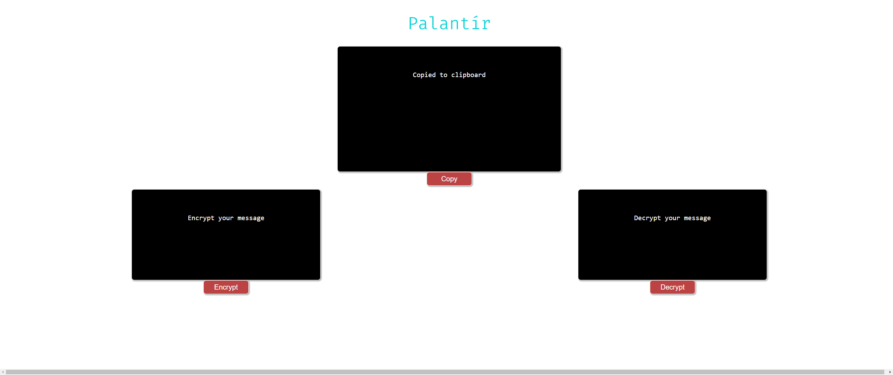

# 
 Encriptador Palantír 

Desafio Alura/Oracle 

Primeiro desafio do curso de programação.

O desafio consistiu em construir uma página web para  criptografar e descriptografar textos de forma simples utilizando apenas **Javascript, HTML e CSS**.

Acesse a página [Palantír](https://andregomessilva.github.io/challenge01/) e faça o teste, criptografe sua mensagem. 

##  Como funciona:

> A letra "e" é convertida para "enter"
> 
> A letra "i" é convertida para "imes"
> 
> A letra "a" é convertida para "ai"
> 
> A letra "o" é convertida para "ober"
> 
> A letra "u" é convertida para "ufat"

### Interface

  

